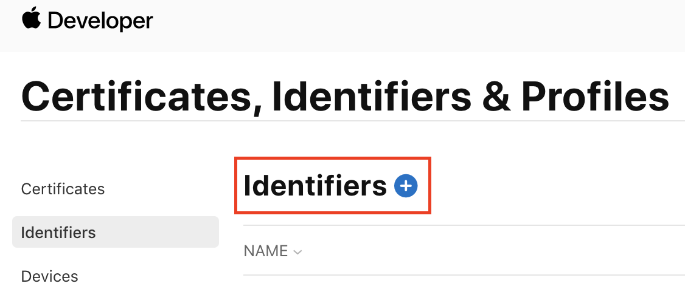
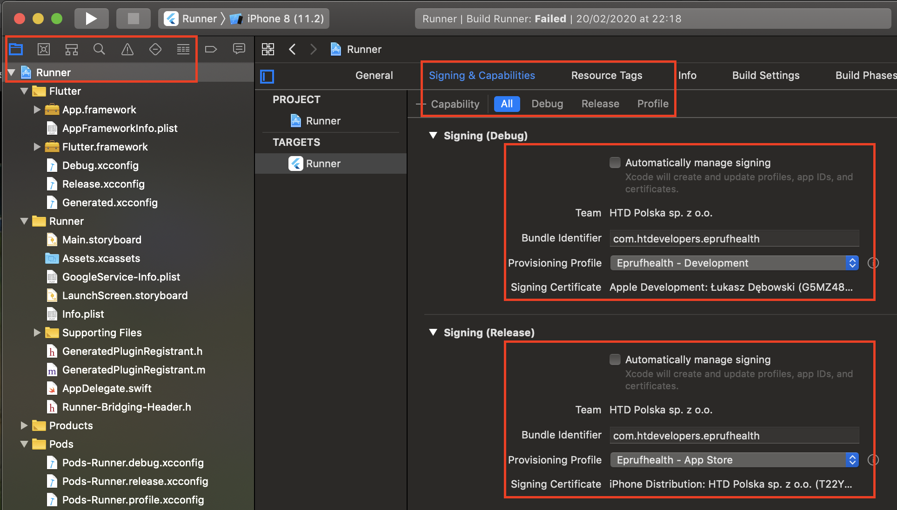
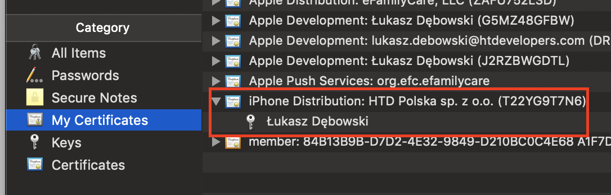
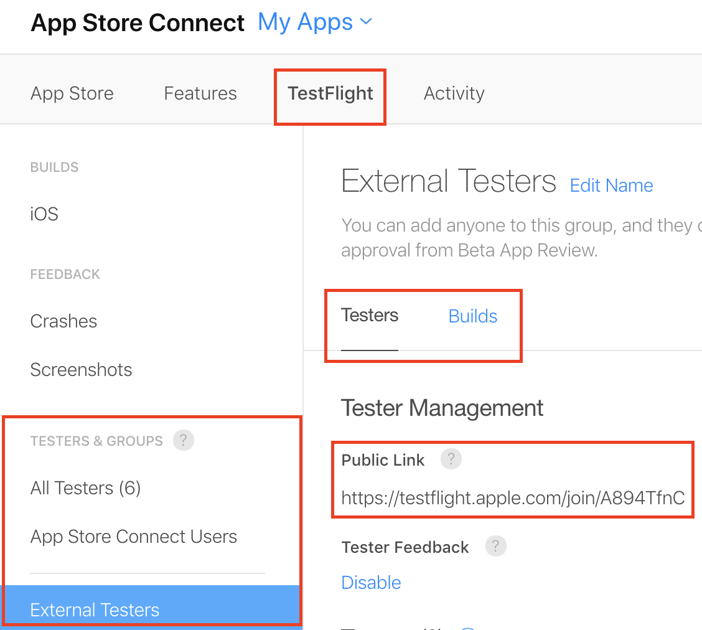

# iOS Code signing

## Certificates, Identifiers & Profiles

**Certificate** - plik potwierdzający Twoją tożsamość, wygenerowany przez Apple, po złożeniu Certificate Signing Request (CSR) z Twojego Mac’a. Składa się z public/private keys, przetrzymywany w Keychain Access na komputerze. Rodzaje:

  * Apple Development - tworzony per osoba, po zainstalowaniu i dodaniu do provisioning profile umożliwia uruchomienie aplikacji z Twojego komputera do testowania na prawdziwym urządzeniu (iOS).

  * Apple Distribution - umożliwia instalowanie aplikacji na urządzeniach testowych (Ad hoc profile), oraz deployment do sklepu (App Store profile). 

**Identifier** - unikalny identyfikator aplikacji dla danej organizacji. Zawiera w sobie *Capabilities* których używa aplikacja np. Push Notifications, iCloud, In-App Purchases (domyślnie) i wiele innych. Po więcej informacji, polecam przeczytac [ten artykuł](https://cocoacasts.com/what-are-app-ids-and-bundle-identifiers)

**Device** - zarejestrowane w projekcie urządzenia iOS, na których możemy testować naszą aplikację.
Dodawanie nowych urządzeń itp [tutaj](https://support.smartbear.com/testcomplete/docs/app-testing/mobile/ios/preparing/registering-devices.html)

**Profile** Plik łączący dany certyfikat  (certificate) z daną aplikacją (identifier) oraz urządzeniem (device). Określa urządzenia, dla których aplikacja jest poprawnie podpisana i na których może zostać uruchomiona. Bez zainstalowanego profilu nie da się uruchomić aplikacji na urządzeniu. 
Rodzaje:

  * Development - łączy Apple Development certificate z urządzeniami, umożliwia development aplikacji przez Xcode - osoby których certyfikat nie jest dodany do tego profilu nie uruchomią aplikacji na swoich komputerach po sklonowaniu repo itp (to prawda?). Limit max 100 urządzeń. Zazwyczaj urządzenie jest podpięte do komputera, umożliwia debugowanie przez xcode itp.

  * Ad hoc - łączy Apple Distribution z urządzeniami, umożliwia instalowanie aplikacji na urządzeniach testowych np. poprzez buildy z Bitrise (bardziej jak release mode, build jest zbliżony do tego, który byłby budowany z App Store), wymaga zarejestrowania UDID urządzenia na którym chcemy testować.

  * App Store - umożliwia deploy aplikacji do sklepu (App Store) i TestFlight.

**Każda aplikacja musi być zbudowana z jakimś provisioning profile.** 
Aplikacje muszą być zbudowane przez jakiegoś providera (np Bitrise, AppCenter) - nie można tak po prostu zainstalować aplikacji z pliku na naszym telefonie (w przeciwieństwie do Androida)

----

## Step by step guides / FAQ:

----

#### 1. Zaczynam nowy projekt, jakie kroki wykonać aby odpowiednio skonfigurować certyfikaty?
  1. Upewnij się że jesteś dodany do odpowiedniego teamu:
     * na [developer.apple.com/account](https:developer.apple.com/account) (prawy górny róg, po zalogowaniu - będzie tam widniało HTD Polska bądź inna nazwa teamu - zależnie od projektu)
  2. Stwórz nową aplikację (app identifier): 
     * Identifiers &rarr; + &rarr; Wybierz *App IDs* &rarr; Description - podaj nazwę projektu, Bundle ID - reverse domain, zazwyczaj  htd.*project_name* &rarr; *Register*
        

        
developer.apple.com

        
        

  3. Utwórz certyfikat **Apple Distribution** (jeśli chcesz zbudować aplikacje do sklepów lub dla klienta) lub **Apple Development** (jeśli chcesz zacząć pracę nad aplikacją):
     * Aby utworzyć certyfikat najpierw musisz wygenerować [Certificate Signing Request](https://help.apple.com/developer-account/#/devbfa00fef7), a nastepnie użyc go do utworzenia certyfikatu. Po utworzeniu certyfikatu należy go pobrać i zainstalować na komputerze (poprzez uruchomienie pliku), a następnie dodać do odpowiedniego profilu poprzez [developer.apple.com](https://developer.apple.com/account/resources/certificates/list).
  4. Utwórz odpowiednie profile: **Development**, **Ad hoc** oraz **App Store**:
     * Profiles &rarr; + &rarr; iOS App Development/Ad Hoc/App Store &rarr; Wybierz odpowiedni app identifier (z podpunktu 2) &rarr; Wybierz odpowiednie certyfikaty oraz urządzenia &rarr; Provisioning profile name - *project_name - profile_type*
  5. Pobierz i zainstaluj wszystkie profile
  6. Otwórz projekt w Xcode, i upewnij się że:
     * *Automatically manage signing* jest WYŁĄCZONE
     * Zakładka *Debug* ma wybrany profil *Development*
     * Zakładka *Release* ma wybrany profil *App Store*
     * Zakładka *Profile* ma wybrany profil *Ad Hoc*
     * Wszystkie zakładki mają odpowiedni *Team* oraz *Bundle Identifier* (zgodny z tym co utworzyłeś w podpunkcie 2)
     * Nie ma żadnych błędów w żadnej z zakładek
     * Jeśli w plikach projektu (`project.pbxproj`) powstały jakieś zmiany, najprawdopodobniej powinny się one znaleźć na głównym branchu
        

        
Xcode

        
        

  7. That's all! Jeśli nie ma żadnych błędów, to wszystko powinno być ok. Jeśli chcesz skonfigurować również środowisko do budowania aplikacji np. dla klienta, sprawdź następny punkt

----

#### 2. Skonfigurowałem certyfikaty, co zrobić aby build aplikacji mógł dostać tester/klient?

  1. Musisz zarejestrować urządzenia (w przypadku iOS), na których chcesz aby można było uruchomić aplikację, na [developer.apple.com](https://developer.apple.com/account/resources/certificates/list)
     * Sprawdź *UDID* tych urządzeń np. po podłączeniu iPhone'a do Maca, w iTunes [w ten sposób](https://bjango.com/help/iphoneudid/)
     * Wejdź na [developer.apple.com](https://developer.apple.com/account/resources/certificates/list) w zakładkę *Devices* i zarejestruj urządzenia
  2. Wejdź w zakładkę *Profiles* i dodaj zarejestrowane urządzenia do profilu *Ad Hoc* oraz *Development*
  3. Pobierz zaaktualizowane Profile i zainstaluj je na komputerze
  4. Wgraj pobrane profile na platformę CI/CD używaną w projekcie (np. Bitrise, AppCenter)
  5. Wgraj odpowiedni certyfikat (plik *.p12*) na platformę CI/CD
     * W celu uzyskania pliku *.p12* pobierz odpowiedni certyfikat **Apple Distribution** z [developer.apple.com](https://developer.apple.com/account/resources/certificates/list) (jeśli to Ty utworzyłeś ten certyfikat)
     * Zainstaluj go, otwórz program **Keychain Access** i znajdź certyfikat na liście
     * Rozwiń strzałkę po lewej stronie certyfikatu (powinien być widoczny klucz) &rarr; Right click &rarr; Export &rarr; Wybierz *.p12* jako format pliku
        

        
Keychain

        
        

     * Keychain Access potrafi się czasem zbugować i nie wyświetlać klucza (abyś mógł go wyeksportować jako *.p12*) &rarr; należy wtedy spróbować użyć filtru aby znaleźć problematyczny certyfikat (Keychain czasem zawęża wyszukiwania i ukrywa certyfikat/klucz)
     * Jeśli to nie ty utworzyłeś certyfikat **Apple Distribution**, poproś jego właściciela o wygenerowanie pliku *.p12* i przesłanie Ci go (preferowana opcja), bądź wygeneruj nowy certyfikat **Apple Distribution** aby mieć własny klucz prywatny
  6. Zbuduj aplikację używając zaaktualizowanych profili i certyfikatów poprzez np. Bitrise/AppCenter

---

#### 3. Klient chciałby mieć możliwość testowania aplikacji poprzez TestFlight, co powinienem zrobić aby mu to umożliwić?

  1. Mieć już skonfigurowane certyfikaty oraz dostęp do TestFlight projektu
  2. Wygenerować build podpisany *App Store* Provisioning Profile oraz zdeployować go do App Stora, używając w tym celu np. Bitrise (step **Deploy to iTunes Connect** w workflow, step **Xcode Archive & Export for iOS** musi mieć wybrany *app-store* jako *selected method for export*)
  3. Na [appstoreconnect.apple.com](https://appstoreconnect.apple.com/) wchodząc w odpowiednią aplikację i zakładkę **TestFlight**, utworzyć nową grupę testerów (jeśli jeszcze jej nie ma)
  4. W zakładcę *Builds* dla danej grupy, dodać odpowiedni build (ikona plusa) wygenerowany przy pomocy np. Bitrise
  5. Upewnić się, że nie ma ostrzeżenia *Missing Complience*, a jeśli jest, rozwiązać je klikając w nie i odpowiadając poprawnie na pytania.
  6. Zgłosić dany build do *review* Apple
  7. Po pomyślnym przejściu przez *review*, wysłać klientowi **Public link** do testowania, który znajdziesz w zakładce *Testers* dla danej grupy testerów
      

      
Appstoreconnect

      
      

---

#### 4. Wysłałem komuś build aplikacji do przetestowania ale osoba ta nie może go zainstalować na swoim urządzeniu, co powinienem zrobić?

  1. Sprawdź, czy UDID urządzenia, na którym ta osoba próbuje zainstalować aplikację, jest zarejestrowany w zakładce *Devices* na [developer.apple.com](https://developer.apple.com/account/resources/certificates/list)
  2. Jeśli nie, zarejestruj to urządzenie.
  3. Jeśli urządzenie jest zarejestrowane, upewnij się, że jest dodane do odpowiedniego *Provisioning Profile* w zakładce *Profiles* na [developer.apple.com](https://developer.apple.com/account/resources/certificates/list) - profil *Development* oraz *Ad Hoc*
  4. Jeśli jest, sprawdź czy CI/CD użyte do wygenerowania buildu aplikacji używało odpowiedniego profilu (najpewniej powinien być to *Ad Hoc*), oraz czy ten profil miał w sobie już zarejestrowane dane urządzenie - możesz pobrać Profil i otworzyć go np. w edytorze tekstu, a następnie wyszukać po tekście UDIDu urządzenia - jeśli go nie ma, należy podmienić ten profil na ten z zaaktualizowaną listą urzadzeń z podpunktu 3.
  5. Jeśli mimo wszystko ten ktoś nadal nie może zainstalować aplikacji, sprawdź czy odpowiednie certyfikaty (*.p12*) zostały użyte do stworzenia buildu. 

----

#### 5. Dołączyłem do projektu, co powinienem zrobić, aby móć zacząć pracę nad aplikacją iOS?

  1. Upewnij się że zostałeś dodany jako developer do teamu na [developer.apple.com](https://developer.apple.com/account/resources/certificates/list)
  2. Wygeneruj swój certyfikat **Apple Development** na [developer.apple.com](https://developer.apple.com/account/resources/certificates/list)
     * Aby utworzyć certyfikat najpierw musisz wygenerować [Certificate Signing Request](https://help.apple.com/developer-account/#/devbfa00fef7), a nastepnie użyc go do utworzenia certyfikatu. Po utworzeniu certyfikatu należy go pobrać i zainstalować na komputerze (poprzez uruchomienie pliku), a następnie dodać do odpowiedniego profilu (*Development*) poprzez [developer.apple.com](https://developer.apple.com/account/resources/certificates/list) w zakładcę *Profiles*.

----

#### 6. Chciałbym przetestować aplikację na nowym urządzeniu iOS, jak to zrobić?

  1. [Zarejestruj](https://support.smartbear.com/testcomplete/docs/app-testing/mobile/ios/preparing/registering-devices.html) nowe urządznie na [developer.apple.com](https://developer.apple.com/account/resources/certificates/list) w zakładcę *Devices* dla odpowiedniego teamu/projektu.
  2. Dodaj to urządzenie do profili *Ad Hoc* oraz *Development*, pobierz te profile oraz zainstaluj na swoim komputerze poprzez uruchomienie ich.
  3. Upewnij się, że w Xcode, w danym projekcie, nie ma żadnych błędów w zakładcę *Signing & Capabilities* (w zakładcę *Debug* jeśli chcesz uruchomić aplikację na telefonie bezpośrednio ze swojego komputera)

----

#### 7. Certyfikat używany w projekcie do budowania aplikacji dla klienta/sklepów wygasł, co powinienem zrobić?

  1. Powtórz kroki z punktu 1. oraz 2. tego "poradnika" (z wyjątkiem tworzenia nowego app identifier) - możesz usunąć stare profile/certyfikaty aby się później nie pomylić, który powinieneś użyć na CI/CD (np. Bitrise/AppCenter)

